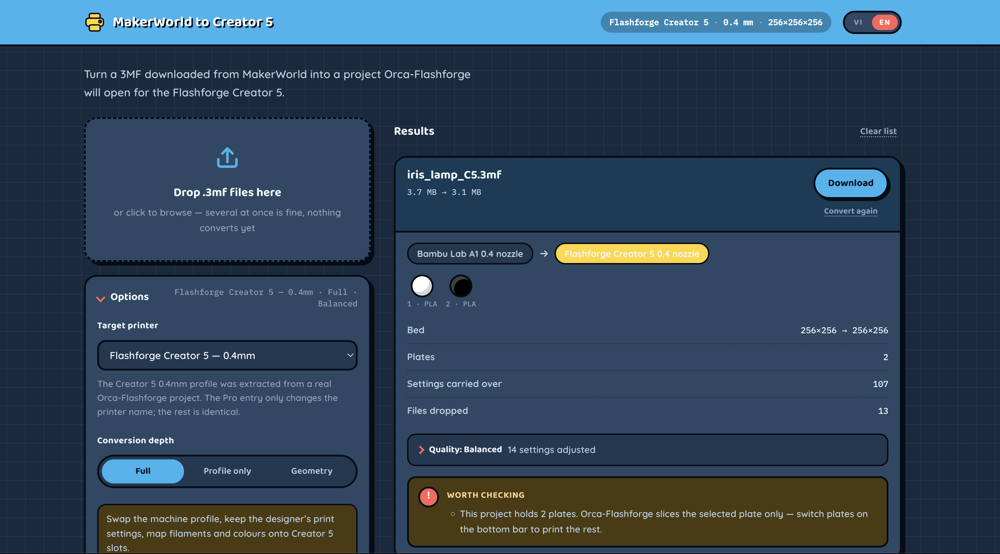
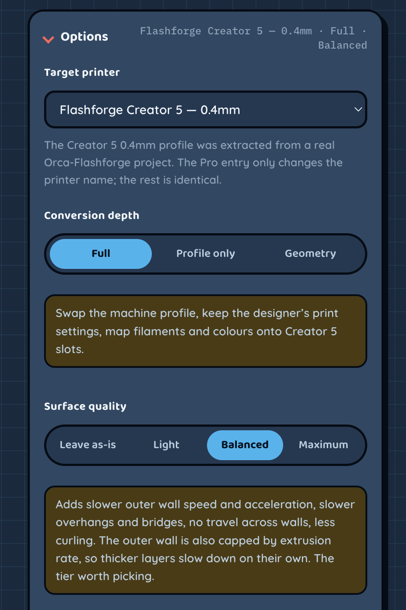
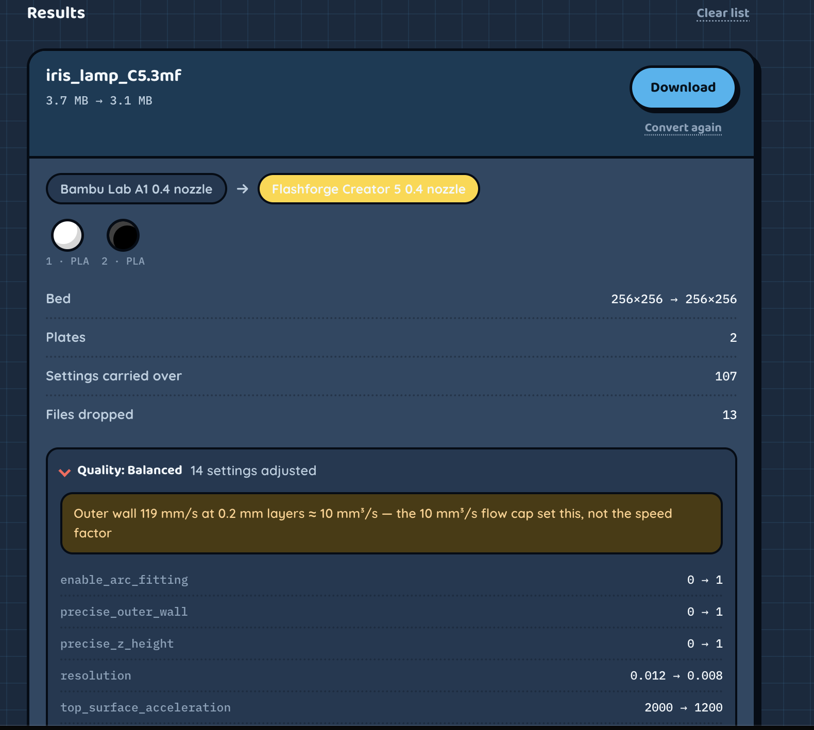

# MakerWorld to Creator 5

Turn a `.3mf` downloaded from MakerWorld (a Bambu Studio project) into a project
Orca-Flashforge will open for the Flashforge Creator 5.

Everything runs in the browser. There is no server, and no file leaves your machine.

The interface is available in English and Vietnamese, switched from the top right.
Bản tiếng Việt của tài liệu này: [README.vi.md](README.vi.md).



---

## Running it

```bash
npm install          # only needed for the tests; the page itself uses no npm at runtime
npm start            # http://localhost:5173
```

The page is static HTML, CSS and JavaScript. To deploy it, copy the folder to any
static host (GitHub Pages, Netlify, Cloudflare Pages). There is no build step.

## Using it

Two columns: the drop box, the queue and the options on the left; the results on
the right, sticky as you scroll, newest file at the top. Dropping a file only
queues it, and nothing converts until you press Convert, so there is time to set
the options first. Each result card has a *Convert again* button that reruns that
same file with the current options, so you never have to drag it in twice.



## What it changes

A 3MF file is a zip. A MakerWorld project holds the geometry, the plate layout,
and the entire Bambu machine setup in `Metadata/project_settings.config`. That
last part is what Orca-Flashforge cannot use: wrong machine profile, wrong
start/end G-code, wrong bed, wrong filament.

The converter keeps what belongs to the *model* and replaces what belongs to the
*machine*:

| Kept | Replaced with Creator 5 | Dropped |
|---|---|---|
| `3D/3dmodel.model`, `3D/Objects/*` | machine profile (256×256×256 bed, klipper, start/end G-code) | Bambu speeds, accelerations, retraction |
| `Metadata/model_settings.config` (part names, matrices, painted regions) | `@FF C5` filament presets | Bambu's `Metadata/filament_settings_*.config` |
| the designer's print settings (see below) | `[Content_Types].xml`, `_rels/.rels`, `slice_info.config` | pre-sliced G-code, the `Auxiliary/` folder |
| preview images, `layer_heights_profile.txt` | | `Metadata/plate_*.json`, `cut_information.xml` |

145 print settings carry over, the ones describing the designer's intent rather
than the machine's capability: layer height, wall count, infill, supports (tree
supports included), brim, raft, seam, ironing, fuzzy skin, hole and contour
compensation, prime tower, per-region filament assignment. The full list is
`CARRY_OVER` in [js/converter.js](js/converter.js).

Anything tied to the hardware (`machine_*`, speeds, accelerations, retraction,
temperatures, cooling) always comes from the Creator 5 profile, never from the
source file.

A few settings mean the same thing but spell their values differently between the
two slicers. Bambu writes `ensure_vertical_shell_thickness: "enabled"` where Flash
Studio expects `ensure_all`. Carried over verbatim, that makes Flash Studio show
its *"Some values have been replaced"* dialog on open. The `ENUM_FIXUPS` table in
[js/converter.js](js/converter.js) translates these values; anything it does not
recognise keeps the Creator 5 default rather than being guessed at.

### Values outside the allowed range

Bambu Studio writes `-1` to mean "automatic" in a couple of settings where Flash
Studio accepts only non-negative numbers: `raft_first_layer_expansion` and
`tree_support_wall_count`. Copied straight across, Flash Studio refuses to open
the file at all: *"-1 not in range"*.

Nothing declares the valid range of each key, so the converter uses the Creator 5
profile as its reference. A negative source value is skipped when the profile is
never negative at that key. The rule predicts both of the keys that the original
tool also drops, and it leaves alone the keys where the profile genuinely holds
negative numbers (`ironing_fan_speed` = -1, `skirt_start_angle` = -135,
`standby_temperature_delta` = -100). The tests scan every exported file to confirm
no case slips through.

### Two things that must be rewritten

`version` and `<metadata name="Application">`. Bambu stamps `02.06.00.51`. Flash
Studio compares that with its own version (2.4.0.2, for instance), reads it as
newer, shows *"The 3MF file version ... is newer than Flash Studio's version"* and
then discards every key it does not recognise. The file has to carry the Flashforge
profile version (`TARGET_VERSION = '2.3.2'`) in both places: `project_settings.config`
and the `Application` line in `3D/3dmodel.model`.

`different_settings_to_system`. This is the list Orca reads to learn which keys in
the project preset differ from the system preset. Leaving it empty means "identical
to the stock preset", and Orca then loads the system preset over every value in the
file, wiping out everything copied from the source. The list holds one entry for the
print preset, one per filament slot, and one for the machine.

Declaring only the keys that differ from the embedded profile is not enough. The
embedded profile itself already differs from the system preset at some keys:
`initial_layer_print_height` is 0.2 in it against 0.25 in the stock
`0.20mm Standard @FF C5` preset. A key matching the profile but differing from the
system preset, left undeclared, gets reset to the system value by Flash Studio. So
the converter declares every key the source file mentions, plus the profile's own
existing list of deviations. For filament slots it declares only the keys it
actually writes.

### Filaments and colours

Per-slot colours are preserved. Each material maps onto the matching `@FF C5`
preset, and with *Retune temperatures per material* on, nozzle and bed temperatures
for that material are written into the file, so it still opens correctly even when
the named preset is not installed in Orca-Flashforge. The Creator 5 has four slots;
a file using more than four filaments has the extras folded into the last one, and
the page warns about it.

With that option on, temperatures come from the source file first (the specific
spool the designer used), falling back to a generic table only when the source
declares none. Volumetric speed limits and flow ratio always stay at the Creator 5
values, since those describe the machine rather than the spool.

### Bed and plates

The Bambu P1S, X1 and A1 are 256×256 as well, so positions stay as they are. For an
A1 mini (180×180) or an H2D (325×320), models are shifted to keep their relative
position on the plate.

MakerWorld projects often hold several plates; the sample in `samples/` has 13. Orca
lays the plates out on a virtual grid, so an object sitting far off the bed is plate
2 or later rather than a mistake. The converter recognises this, does not warn about
it, and does not shift anything when the bed size differs, because each plate has its
own origin and one shared offset would be right only for the first.

## Surface quality

Four tiers, each stacking on the previous one, applied after the designer's settings
have been copied. They trade speed on the outer wall, a small share of total
extrusion time, and leave alone the settings that multiply print time.

| Tier | Adds |
|---|---|
| Leave as-is | nothing |
| Light | `enable_arc_fitting`, `resolution` 0.012→0.008, `precise_outer_wall`, `precise_z_height`, lower `top_surface_acceleration` |
| Balanced | lower `outer_wall_speed` (flow-bound, see below), `outer_wall_acceleration` 5000→2500, `small_perimeter_speed`, the `overhang_*_speed` steps, `bridge_speed`, enables `reduce_crossing_wall` and `slowdown_for_curled_perimeters` |
| Maximum | `outer_wall_speed` lower still, `outer_wall_acceleration` →1500, lower `inner_wall_acceleration` and `default_acceleration`, `top_shell_layers` +1, `wall_loops` +1 |

Layer height, `initial_layer_print_height`, `sparse_infill_density` and ironing are
never touched, and a test enforces that.

### Outer wall speed varies per file

Most keys in the table are constants derived from the machine profile.
`outer_wall_speed` is additionally bounded by extrusion rate:

```
speed = min( profile_speed × factor,  flow_cap / (layer_height × line_width) )
```

The cap is 10 mm³/s for Balanced and 7 mm³/s for Maximum. The same figure in mm/s
produces very different flow depending on layer height, which is why flow is the
quantity worth holding constant instead of speed:

| Layer height | Balanced | Maximum |
|---|---|---|
| 0.12 mm | 120 mm/s (speed factor decides) | 80 mm/s |
| 0.20 mm | 119 mm/s | 80 mm/s |
| 0.24 mm | 99 mm/s | 69 mm/s |
| 0.28 mm | 85 mm/s | 60 mm/s |
| 0.32 mm | 74 mm/s | 52 mm/s |

Thin layers let the speed factor decide, so nothing slows down for no reason. Thick
layers let the flow cap decide, keeping the machine well away from PLA's 18 mm³/s
ceiling. The result card names whichever one applied, and lists every value that
changed.



`line_width` is accepted either in mm or as a percentage of nozzle diameter. Speed
values written as percentages (`50%`, meaning relative to another speed) pass through
untouched, since they already follow whatever they are tied to.

### Two rules inside `applyQuality()`

The target value is computed from the machine profile and then taken as a `min`
against the current value, so a file the designer already tuned finer is not dragged
back. Every key also has a floor and a cap, so an already-slow profile is not pushed
down to something absurd; the floor wins over the flow cap.

The tier tables use numeric and boolean keys only, and only keys present in the
Creator 5 profile. Enum settings (`ironing_type`, `wall_generator`, `seam_slope_type`)
are left out, because there is no way to verify which spelling Flash Studio accepts,
and a wrong guess brings back the "some values have been replaced" dialog. Turn
ironing on by hand in Orca-Flashforge if you want it.

The card shows each change as `outer_wall_speed 200 → 120`. There is no estimated
time saving, because that cannot be known without slicing. Orca gives you the real
number.

## Conversion depth

Full does everything described above. Machine profile only uses the stock Creator 5
print settings and ignores the ones in the source file. Geometry only writes a plain
geometry 3MF with no settings at all, which you then set up in the slicer yourself.

## Your own profile

The embedded Creator 5 profile was extracted from a real Orca-Flashforge project
(`Flashforge Creator 5 0.4 nozzle`, 679 setting keys). If you run a nozzle other than
0.4, or have tuned your machine, drop a `.3mf` saved from your own Orca-Flashforge
into *Your own profile* and the converter will use that profile instead.

To replace the embedded one outright:

```bash
npm run extract-profile -- "My Print_CREATOR5.3mf"
```

## Tests

```bash
npm run fixtures     # build mock MakerWorld files from a Creator 5 sample
npm test             # 126 logic tests + 14 static tests + 47 comparisons against real files
node test/e2e.mjs    # 33 tests in real Chrome
```

`test/e2e.mjs` needs `npm start` running and Google Chrome installed.

`test/samples.cjs` converts two real MakerWorld files in `samples/` (MoonLamp, a Bambu
P1S project with 13 plates and 290 MB of mesh; iris_lamp, a Bambu A1 project with 2
plates) and compares the output against the `_CREATOR5.3mf` files the original tool
produced: same machine, same bed, same filament presets, same colours, same layer
height, infill, shell and supports, with 290 MB of mesh passing through byte for byte.
A separate test compares the output against a real Creator 5 project: same set of
setting keys, every machine-level key matching value for value, and an identical
`[Content_Types].xml`.

A 48 MB file takes roughly 7 seconds to unpack, rewrite and repack at compression
level 4.

## Layout

```
index.html
css/style.css
js/
  app.js               interface, drag and drop, result cards
  converter.js         all conversion logic (also runs under Node)
  i18n.js              VI/EN strings
  profiles/creator5.js Creator 5 profile (generated)
  vendor/fflate.min.js zip/unzip
tools/extract-profile.mjs
test/
```

## Limits

This tool rewrites *settings*, not *geometry*. A model designed around an AMS, for a
bed larger than 256×256, or using a feature only Bambu printers have, still needs a
manual pass in Orca-Flashforge. Check the preview before you print.
